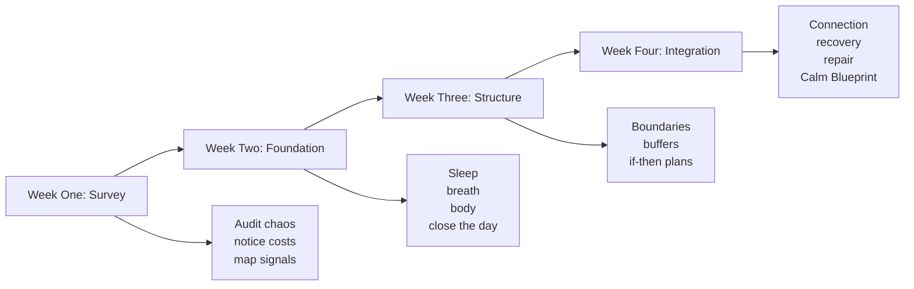

By now you know the argument.

Crisis can become architecture. Calm can become architecture too.

You have seen the hidden thermostat, the rooms, the windows, the thresholds, the walls, the buffers, the foundation, and the forge. The remaining question is not whether the model makes sense. It is whether it can be lived.

It can.

But it should be lived in sequence.

When people attempt change without sequence, they often create another form of chaos. They try to renovate everything at once, then conclude they lack discipline when what they actually lacked was a build order.

The month ahead is not about perfection. It is about installation.

Week One is for survey.
Week Two is for foundation.
Week Three is for structure.
Week Four is for integration.

That four-part rhythm matters because insight needs to become placement. You are not collecting ideas. You are redesigning how the house works.

Here is the basic build.

| Week | Focus | Core task |
|---|---|---|
| Survey | See the current house honestly | Notice patterns, costs, signals, and repeated points of strain |
| Foundation | Stabilize the body and the day | Protect sleep, breath, body, and the first/last minutes of the day |
| Structure | Install supports | Add boundaries, buffers, and planned responses |
| Integration | Make calm social and sustainable | Connect, recover, repair, and write the blueprint you will keep |

Week One: Survey

This is the week of noticing without melodrama.

Complete the Chaos Baseline Audit.
Complete the Hidden Invoice Ledger.
Write down your most common body stress signals.
Look at your sleep honestly.
Walk through one physical room and one digital room and note where friction is being manufactured.
List the moments in the week when you reliably become hurried, irritable, avoidant, or scattered.

You are learning the house.

Week Two: Foundation

This week is about helping the body believe that change will not come as punishment.

Choose a consistent wake time.
Keep screens out of the last minutes before sleep if possible.
Use a three-breath pause in the morning.
Add one evening close-down ritual.
Reset one physical surface daily.
Remove one digital noise source.
Take one brief walk without input.
Name one body cue before it becomes a tone problem.

Do not try to become glamorous. Become legible.

Week Three: Structure

Now the house gets support.

Choose three boundaries you actually need.
Install three buffers.
Write three if-then plans.
Create one weekly planning block.
Practice one clean no.
Create one sentence you can use when you need time before committing.

This week often feels uncomfortable because reinforcement shifts. Other people may notice. Old patterns may tug. You may feel newly visible to yourself.

Good.

A wall has been installed where collapse once flowed.

Week Four: Integration

Now calm becomes communal and durable.

Protect one recovery block.
Have one repair conversation.
Create one simple ritual of connection.
Take one no-input walk.
Allow one form of play or beauty that serves no productive justification.
Write your Calm Blueprint.

This final step matters because calm is not only private. A steadier life includes relationships strong enough to share the weather.

### Research Note
The U.S. Surgeon General’s advisory describes social connection as fundamental to health and survival, warns that lack of social connection is associated with increased risks including premature death, heart disease, stroke, anxiety, depression, and dementia, and argues that higher social connectedness is also linked to better community outcomes such as safety, resilience, and prosperity (HHS Office of the Surgeon General 2023).

That is why the calm life cannot be built as a sealed bunker.

You need connection.
You need witness.
You need shared laughter.
You need honest support.
You need relationships where the nervous system is not always performing.

The house is not only for protection from weather.
It is also for hospitality.

At the end of these thirty days, write the following.

My top chaos pattern:

My earliest warning signs:

My foundation practices:

My three daily thresholds:

My non-negotiable boundary:

My weekly buffer:

My recovery ritual:

My support person or community:

My plan for predictable stress points:

My definition of a calm life:

Make it concrete.

Not “be more peaceful.”
Instead: “Go to bed at a humane hour four nights a week, leave margin before important conversations, keep my phone out of the first part of the morning, and stop committing from guilt.”

Not “have better relationships.”
Instead: “Pause before defensive tone, ask directly for what I need, and protect one unhurried conversation per week.”

Not “reduce stress.”
Instead: “Install buffer time, sleep earlier, stop checking messages at night, and stop pretending my body will not invoice me.”

The Calm Blueprint is not a grand speech. It is a maintenance manual.

And because maintenance is part of adulthood, expect revision. The blueprint changes as your life changes. New seasons require new support. Children grow. Work changes. Health changes. Grief visits. Joy enlarges the house. There are new rooms to build, old rooms to simplify, doors to close, windows to clean, and weather to face.

The point is not to finish the house forever.

The point is to stop living as if the house must burn before you believe it is warm.

Here is a simple visual for the month ahead.

If you follow this plan imperfectly, it can still change you.

That may be the most important sentence in the chapter.

Because one of the old houses many readers live in is the house of perfectionism. They believe a practice only counts if it is complete, consistent, elegant, and immune to interruption. Under that standard, life redesign becomes another arena for spiritualized self-criticism.

Reject that.

The calm life is not built by immaculate people.
It is built by returning people.

The person who comes back to the plan after a messy week.
The person who tells the truth sooner.
The person who apologizes faster.
The person who sleeps instead of proving a point.
The person who leaves margin and bears the temporary discomfort of doing less.
The person who stops calling catastrophe their muse.

You do not need to become someone else.

You need to stop living in a structure that keeps summoning the old version of you.

<figure class="calm-figure calm-figure--quiet-house-build">
  
Figure 6

<svg viewBox="0 0 900 520" role="img" aria-labelledby="calm-figure-6-title calm-figure-6-desc">
  <title id="calm-figure-6-title">Thirty-day quiet house roadmap</title>
  <desc id="calm-figure-6-desc">A four-week roadmap labeled survey, foundation, structure, and integration.</desc>
  <text class="calm-heading" x="450" y="88">30-Day Quiet House Build</text>
  <path class="calm-road" d="M132 286 C250 136 340 410 450 258 C560 106 650 396 768 220" />
  <g class="calm-week">
    <circle cx="150" cy="282" r="54" /><text x="150" y="274">Week 1</text><text x="150" y="302">Survey</text>
    <circle cx="350" cy="330" r="54" /><text x="350" y="322">Week 2</text><text x="350" y="350">Foundation</text>
    <circle cx="550" cy="226" r="54" /><text x="550" y="218">Week 3</text><text x="550" y="246">Structure</text>
    <circle cx="750" cy="220" r="54" /><text x="750" y="212">Week 4</text><text x="750" y="240">Integration</text>
  </g>
  <path class="calm-pencil" d="M150 356 v50 M350 404 v38 M550 300 v58 M750 294 v58" />
  <text class="calm-small" x="150" y="430">notice patterns</text>
  <text class="calm-small" x="350" y="466">stabilize body</text>
  <text class="calm-small" x="550" y="382">install supports</text>
  <text class="calm-small" x="750" y="376">keep the blueprint</text>
</svg>
  <figcaption>Calm becomes durable when change follows a build order.</figcaption>
</figure>
